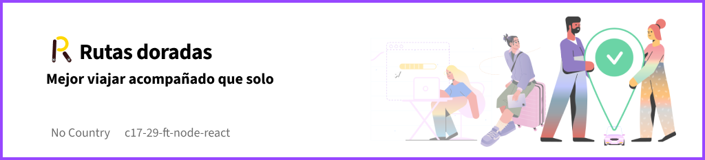

# -Rutas Doradas App ✨



## 📔 Table Of Contents

- [-Rutas Doradas App ✨](#-rutas-doradas-app-)
  - [📔 Table Of Contents](#-table-of-contents)
  - [📋 About this project 🔝](#-about-this-project-)
  - [🎥Promotional Video 🔝](#promotional-video-)
  - [⚙️ Technology Stack 🔝](#️-technology-stack-)
    - [🎨 UX UI Design tech stack 🔝](#-ux-ui-design-tech-stack-)
    - [🎆 Front-End 🔝](#-front-end-)
    - [🧰 Back-End 🔝](#-back-end-)
    - [🌠 Quality Assurance 🔝](#-quality-assurance-)
  - [🤵‍♂️Teams 🔝](#️teams-)
    - [👷‍♂️ Project Manager 🔝](#️-project-manager-)
    - [🧑‍🎨 UX-UI Teams 🔝](#-ux-ui-teams-)
    - [🧑‍💻 Front-End Teams 🔝](#-front-end-teams-)
    - [💻 Back-end Teams 🔝](#-back-end-teams-)
    - [📊 QA Teams 🔝](#-qa-teams-)
  - [🗃️ Project 🔝](#️-project-)
    - [📚 Workspaces 🔝](#-workspaces-)
    - [📚 More Info 🔝](#-more-info-)
  - [🛠️ Run Locally 🔝](#️-run-locally-)
    - [🎚️ Scripts 🔝](#️-scripts-)
      - [🧩 Client App 🔝](#-client-app-)
      - [🔧 Server App 🔝](#-server-app-)

## 📋 About this project [🔝](#-rutas-doradas-app-)

Rutas Doradas is a network where people share car trips from one city to another, covering medium and long distances, splitting costs fairly among all travelers or contributing under some agreement.
Users themselves create trips according to where they need to go and when they are available to travel. Other users can request to join the trip with the driver based on the travel proposal that has been published.

## 🎥Promotional Video [🔝](#-table-of-contents)

promo video section

## ⚙️ Technology Stack [🔝](#-rutas-doradas-app-)

### 🎨 UX UI Design tech stack [🔝](#-rutas-doradas-app-)

[](https://www.figma.com/files/recents-and-sharing?fuid=1121329785337751851)

### 🎆 Front-End [🔝](#-rutas-doradas-app-)

[](https://react.dev/) [](https://nextjs.org/)

### 🧰 Back-End [🔝](#-rutas-doradas-app-)

[](https://nodejs.org/docs/latest-v20.x/api/index.html) [](https://expressjs.com/) [](https://www.npmjs.com/) [](https://www.postman.com/) [](https://swagger.io/) [](https://www.mongodb.com/atlas/database)

### 🌠 Quality Assurance [🔝](#-rutas-doradas-app-)

[](https://www.selenium.dev/) [](https://www.office.com/) [](https://www.office.com/)

## 🤵‍♂️Teams [🔝](#-rutas-doradas-app-)

### 👷‍♂️ Project Manager [🔝](#-rutas-doradas-app-)

||
|:-:|
| **Jim Flores** |
| [](https://github.com/Jim-flores?tab=overview&from=2024-03-01&to=2024-03-31)[](https://www.linkedin.com/in/jim-flores-teves-328a1323a)|

### 🧑‍🎨 UX-UI Teams [🔝](#-rutas-doradas-app-)

|  |  |  |
|:-:|:-:|:-:|
| **Sofia Molina** | **Valen Palmieri** | **Diego Alexander** |
|[](https://github.com/sofiavmolina)[]( https://www.linkedin.com/in/sofia-molina-3a2680267) | [](https://github.com/ValenPalmieri)[](https://www.linkedin.com/in/valentina-palmieri-96-) []( https://www.behance.net/valentinapalmieri)|[](https://github.com/DiegoAlexander7)[](https://www.linkedin.com/in/diego-alexander-918a62210) |

### 🧑‍💻 Front-End Teams [🔝](#-rutas-doradas-app-)

|  |
|:-:|
| **Adel Fetner** |
|[](https://github.com/AdelFetner)[](https://www.linkedin.com/in/adelfetner) |

### 💻 Back-end Teams [🔝](#-rutas-doradas-app-)

|  | |  |  |  |
|:-:|:-:|:-:|:-:|:-:|
| **David Caycedo**  | **Rogelio Romo**  | **Pedro Molina**  | **Agustin Gracia**  | **Luis Correa** |
|[](https://github.com/David-Coach-Dev)[](https://www.linkedin.com/in/davidcoachdev/) | []( https://github.com/RogelioRomo)[]( https://www.linkedin.com/in/rogelio-romo-5712591b8/) | [](https://github.com/pedroMolina-lab)[](https://www.linkedin.com/in/pedro-molina-pem) | [](https://github.com/Agustingmaggi)[](https://www.linkedin.com/in/agustin-garcia-maggi/) | [](https://github.com/luiscorrea7)[](https://www.linkedin.com) |

### 📊 QA Teams [🔝](#-rutas-doradas-app-)

|  | |
|:-:|:-:|
| **Luciana Calvi** | **Juan Cristancho** |
|[](https://github.com)[](https://www.linkedin.com/in/luciana-belén-calvi-520111214) | [](https://github.com/JuanCris09)[]( https://www.linkedin.com/in/jp-cristancho/) |

## 🗃️ Project [🔝](#-rutas-doradas-app-)

### 📚 Workspaces [🔝](#-rutas-doradas-app-)

The following table shows the project's workspaces.

| Name | Path | Description | url |
| :-: | :-: | :-: | :-: |
| `✨ root` | / | The project's root path | [Repo App](https://github.com/No-Country/c17-29-n-node) |
| `🖼️ client` | /client    | application Front-End    |[Front-End](https://rutasdoradas.vercel.app/) |
| `🎛️ server` | /server    | application Back-End      |[Back-End](https://rutasdoradasback.vercel.app/api/docs) |

### 📚 More Info [🔝](#-rutas-doradas-app-)

| Repository | Deploy | Data Base | License |
|:-: | :-: | :-: | :-:|
|[](https://github.com/No-Country/c17-29-n-node) | [](https://vercel.com/) | [](https://www.mongodb.com/atlas/database) | [](./LICENSE.MD)|

## 🛠️ Run Locally [🔝](#-rutas-doradas-app-)

👉🏻 To use locally Ruta Dorada, you need to:

Clone our repository

```sh
git clone https://github.com/No-Country/c17-29-n-node.git
```

Move into client folder and install dependencies

```sh
cd client | npm i
```

Run the project locally of the client

```sh
npm run dev
```

Move into server folder and install dependencies

```sh
cd server | npm i
```

Run the project locally of the server

```sh
npm run dev
```

### 🎚️ Scripts [🔝](#-rutas-doradas-app-)

#### 🧩 Client App [🔝](#-rutas-doradas-app-)

- `npm run start`: Run the application preview production client with next.
- `npm run dev`: Run the application development client with next.
- `npm rum build`: Builds the production bundle for the web application.
- `npm rum lint`: Linting errors in the codebase automatically.

#### 🔧 Server App [🔝](#-rutas-doradas-app-)

- `npm rum start`: Run the application development server with node
- `npm run dev`: Run the application development server with node --watch.
- `npm rum dev:start`: Run the application development server with nodemon.
